# Tarea - Desarrollo en Plataformas

**Estudiante:** Josue Tenesaca
**Fecha:** 18/12/2025
**Paralelo:** 3

---

## Mis Decisiones de Diseño

### 1. Tabla
Se definió la estructura de la tabla con los siguientes campos:

| Campo | Tipo | ¿Obligatorio? |
| :--- | :--- | :--- |
| PLACA | string | si |
| TIPO | string | si |
| PROPIETARIO | string | no |
| OBSERVACIONES | text | no |

### 2. Tipos de vehículo
Se agregaron 3 tipos de vehículo:
* Automóvil
* Motocicleta
* Camioneta

### 3. ¿Se puede eliminar registros?
Los registros se eliminan automáticamente al momento de marcar la salida de un vehículo. Lo hice de esta forma ya que, al ser un sistema pequeño y simple, no se sobrecarga la memoria de la computadora donde se ejecutará (ya que se ejecutará localmente).

---

## Configuración y Creación del Proyecto

### 1. Crear Repositorio en GitHub
Se creó el repositorio para alojar el historial de versiones del proyecto.

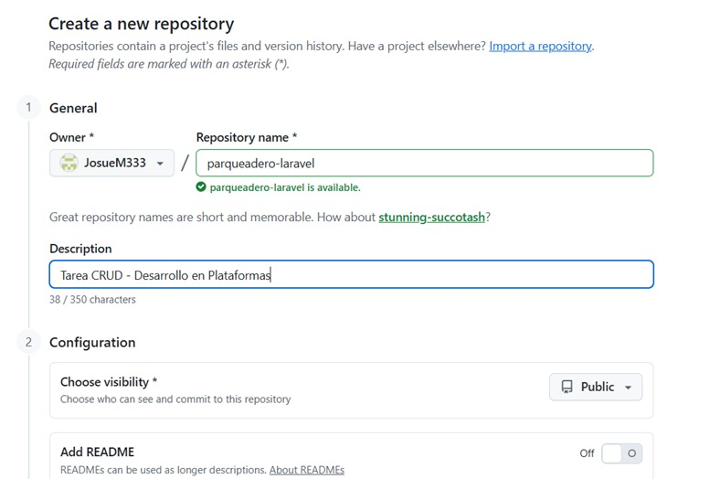

**Datos del repositorio:**
* **Owner:** JosueM333
* **Repository name:** parqueadero-laravel
* **Description:** Tarea CRUD - Desarrollo en Plataformas
* **URL Generada:** `https://github.com/JosueM333/parqueadero-laravel.git`

### 2. Crear el Proyecto con Laravel Herd
Se utilizó Laravel Herd para la gestión del proyecto.

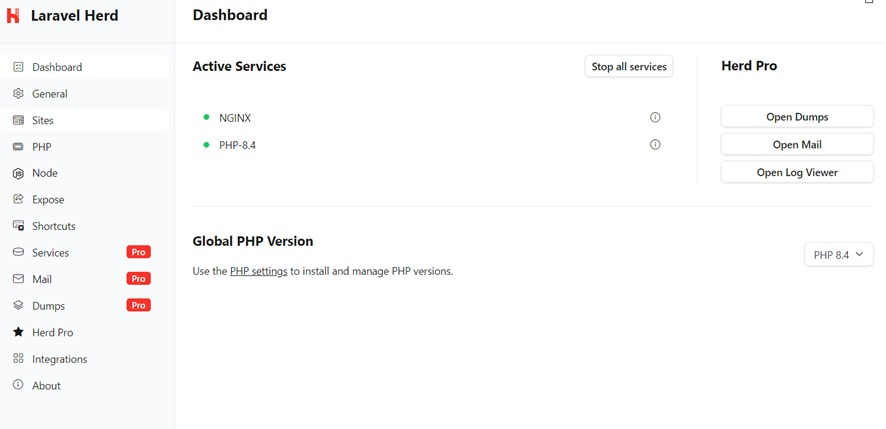

**Comandos utilizados en terminal:**

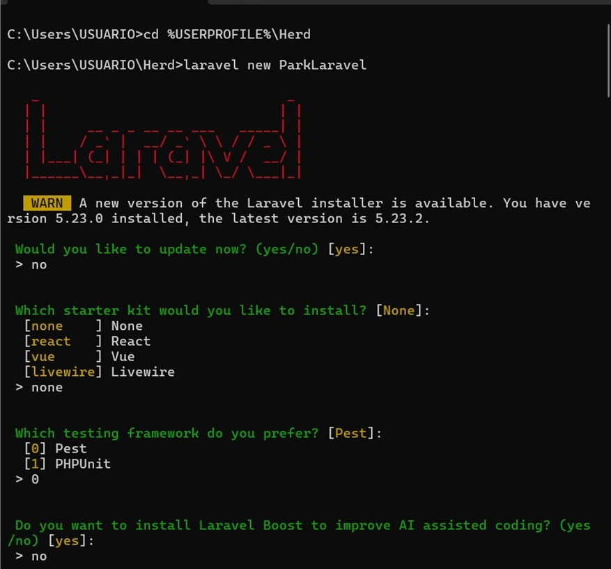

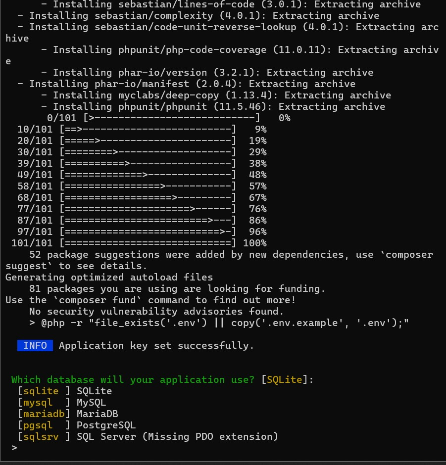

**Comandos utilizados para crear mi repositorio y subirlo a GitHub**

git init
git add .
git config --global user.email "jrsmat500@gmail.com"
git config --global user.name "JosueM333"
git commit -m "Primer commit/agregar archivos"
git branch -M main
git remote add origin [https://github.com/JosueM333/parqueadero-laravel.git](https://github.com/JosueM333/parqueadero-laravel.git)
git push -u origin main

**Configuruación de Base de Datos**
Crear la base de datos (Opción A - MySQL)
Se creó la base de datos utilizando sentencias SQL:

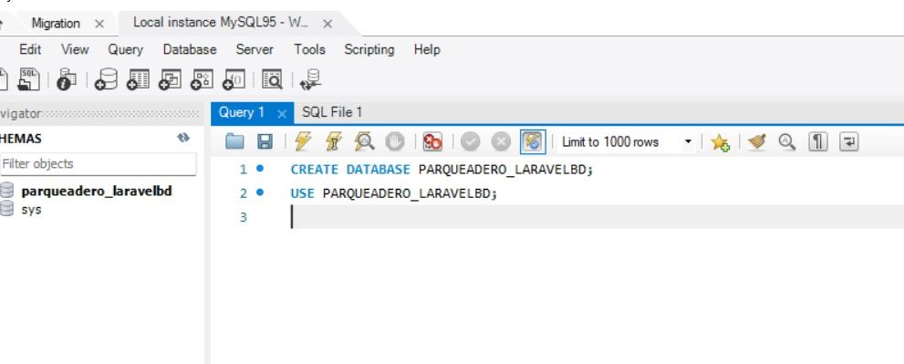

**Configurar conexión en Laravel (.env)**

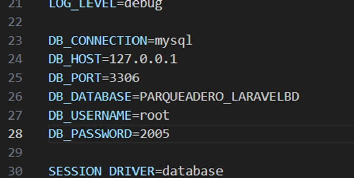

**Verificar conexión y Migraciones**

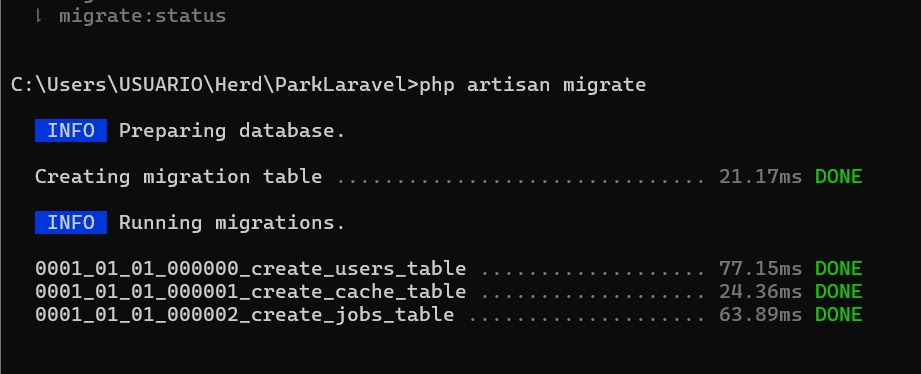

**Pruebas de la Aplicación**

1. Registrar New Ingreso
Formulario para ingresar un vehículo. Pide placa, tipo, propietario y observaciones.

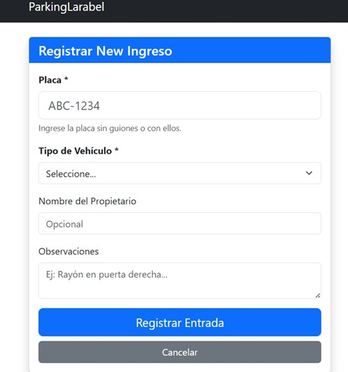

2. Vehículos in the Park (Listado)
Visualización de los vehículos ingresados con su hora de ingreso.

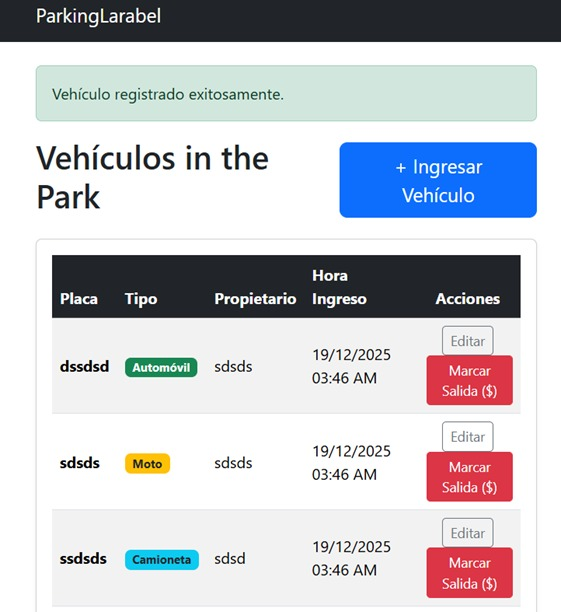

3. Editar Datos del Vehículo
Interfaz para modificar datos como el tipo o el propietario antes de la salida.

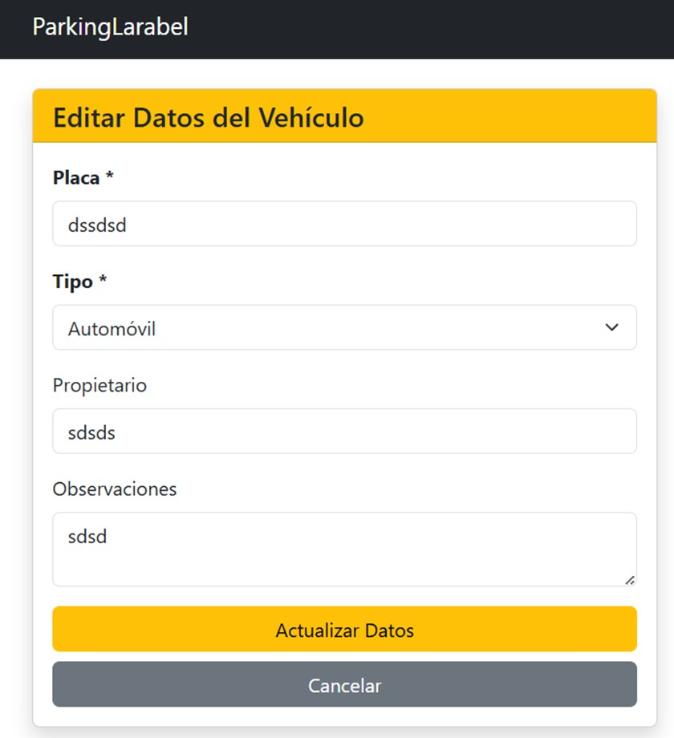

4. Marcar Salida
Al marcar la salida, el sistema calcula el tiempo y el total a pagar, mostrando un mensaje de éxito (ej. "Total a pagar: $5") y eliminando el registro de la lista activa.

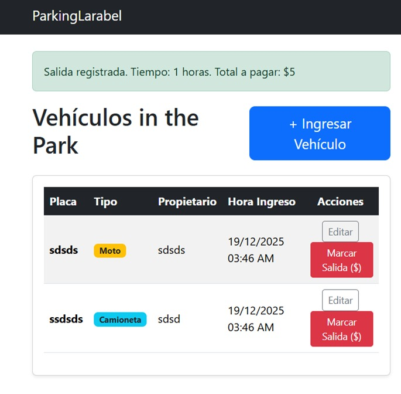

5. Ver en móvil
La aplicación es responsiva y se adapta a pantallas de dispositivos móviles.

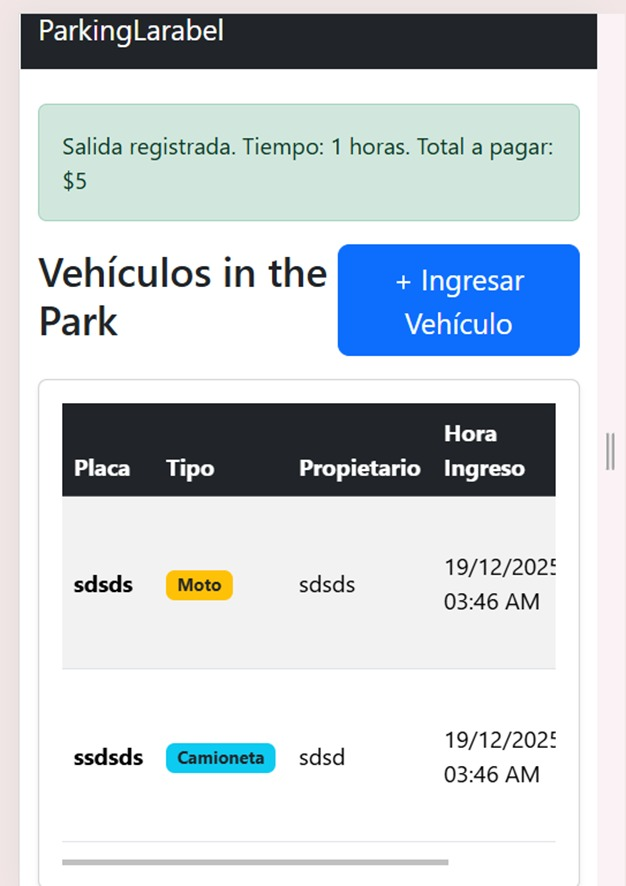

